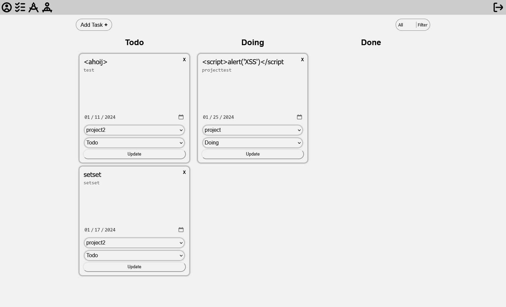
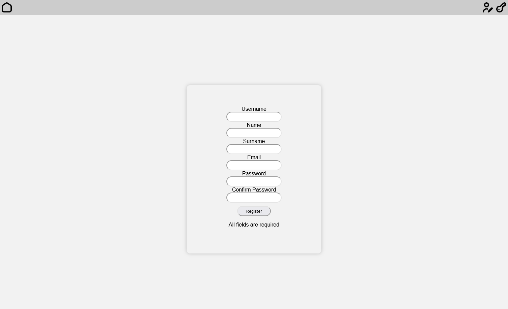

# Semestral Work - Simple Todo List

This project is a simple todo list application developed as a semestral work. It allows users to create tasks and accomplish them.

## Features

- **Task Management**: Users can create, update, and delete tasks.
- **Collaboration**: Users can collaborate on tasks by creating projects and inviting other users to join them.
- **Admin Control**: An admin user can manage all tasks.

## Types of users:

- **User**: Basic user with permission to create and manage their own tasks.

- **Admin**: a user with advanced permissions to manage user accounts and support other users.

- **Owner**: A user with the highest privileges, capable of managing the entire system.

## Technologies Used

The application is written in:

- PHP
- HTML
- JavaScript
- CSS

## Used resources

- Icons `https://www.freepik.com/author/uicons/icons/uicons-rounded-bold_5087?t=f`

## Getting Started

To get a local copy up and running, follow these steps.

#### Using MAMP:

1. Clone the repo
2. Put the project folder into the htdocs folder of your MAMP installation
3. Start the MAMP server
4. Open the project in your browser using the URL `http://localhost:8888`
5. Create a database named `todo_list` in phpMyAdmin and import the `todo_list.sql` file from the project folder

## UI Examples

## Contact

Your Name - [nurmuedu@fel.cvut.cz](vscode-file://vscode-app/c:/Users/Eduard/AppData/Local/Programs/Microsoft%20VS%20Code/resources/app/out/vs/code/electron-sandbox/workbench/workbench.html "mailto:&#x79;&#111;&#x75;&#114;&#64;&#101;&#x6d;&#x61;&#x69;&#108;&#x2e;&#99;&#x6f;&#x6d;")

Project Link: [https://github.com/your_username/repo_name](vscode-file://vscode-app/c:/Users/Eduard/AppData/Local/Programs/Microsoft%20VS%20Code/resources/app/out/vs/code/electron-sandbox/workbench/workbench.html "https://github.com/your_username/repo_name")

Please replace placeholders with your actual information.

**Next Steps:**

- Add more specific instructions in the "Getting Started" section.